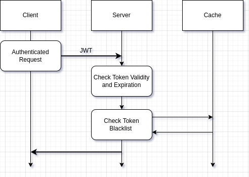

# Blacklisting JWT

Simple blacklisting implementation done on LOG-OUT. 
Relies on a redis cache to store token which needs to be invalidated.

Start Redis with docker executing:

    docker run --name my-redis-container -p 7001:6379 -d redis
    
Endpoints to Test the implementation:

- POST /login (which creates a JWT signed token)
- PUT /logout (which blacklists a JWT)
- GET /regular (which returns a string if JWT provided is valid)

For further explanation refer to the medium article.